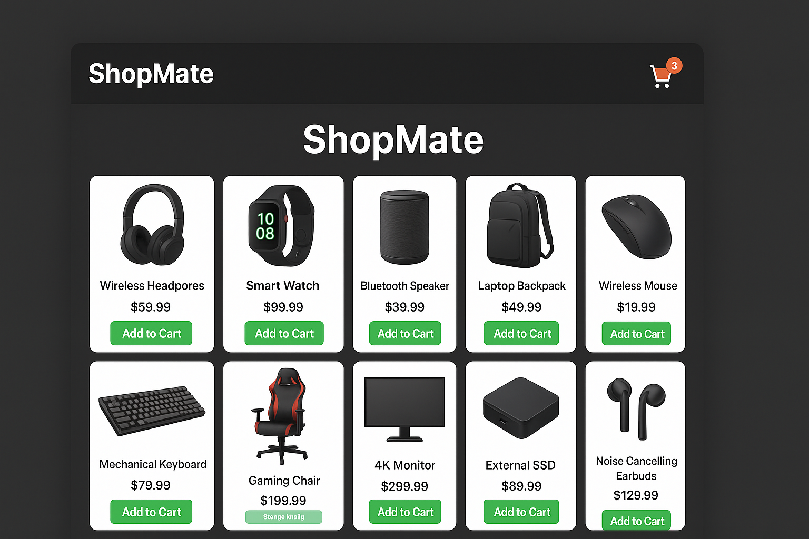

# ShopMate

**ShopMate** is a simple, interactive shopping cart web app. Users can browse up to 10 items, add or remove them from the cart, and complete checkout by entering their **name**, **address**, and **email**. If the cart is empty, users are automatically redirected to the homepage.

---

## Features

- Add & remove items from the cart  
- Supports up to 10 products  
- Empty cart redirects to `index.html`  
- Checkout form for **name**, **address**, and **email**  
- Clean and responsive UI  

---

## Project Structure
ShopMate/
│
├── index.html # Homepage with product list
├── cart.html # Shopping cart page
├── checkout.html # Checkout page
├── css/
│ └── style.css # Styles
├── js/
│ └── app.js # Add/remove items, checkout logic
└── assets/
├── images/ # Product images
└── banner.png # Banner image for README

---

## How to Use

1. Open `index.html` in a browser  
2. Browse the products (up to 10 items)  
3. Click **Add to Cart** to add items  
4. Navigate to **Cart** to view selected items  
5. Remove items if needed  
6. Checkout by entering **name**, **address**, and **email**  
7. Submit to complete the checkout  

---

## Technologies Used

- **HTML** – Page structure  
- **CSS** – Styling and layout  
- **JavaScript** – Cart management & checkout functionality  
- **LocalStorage** – Persist cart data between pages  

---

## Future Enhancements
- Integrate payment gateway  
- Enhance mobile responsiveness  
